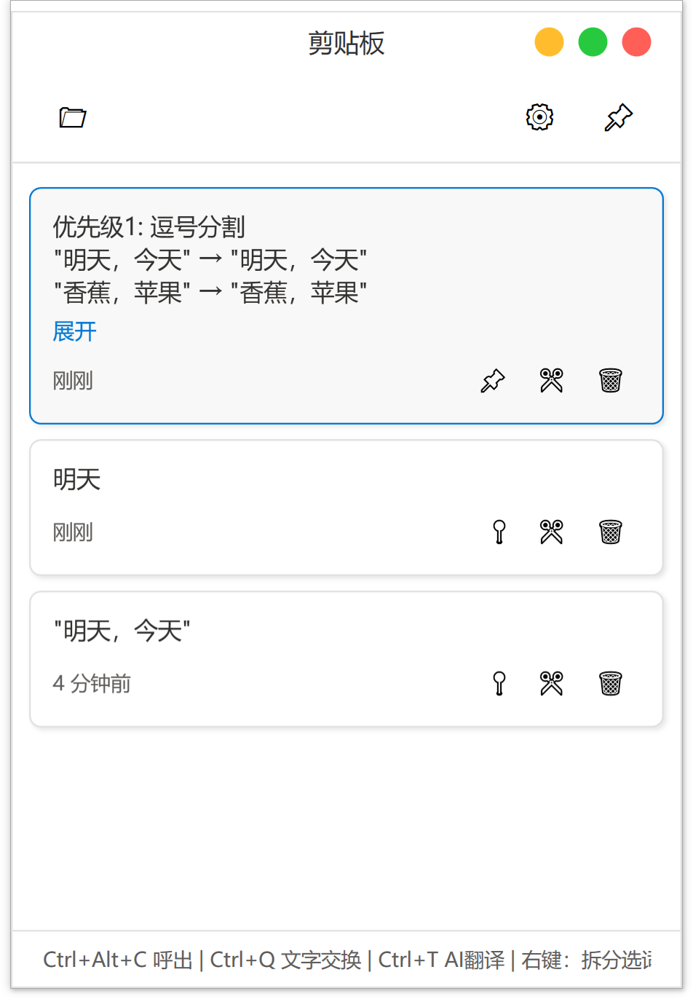
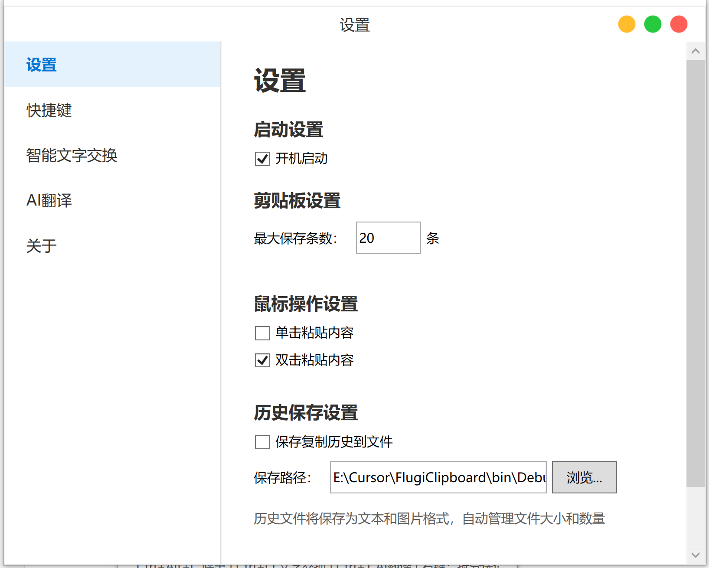
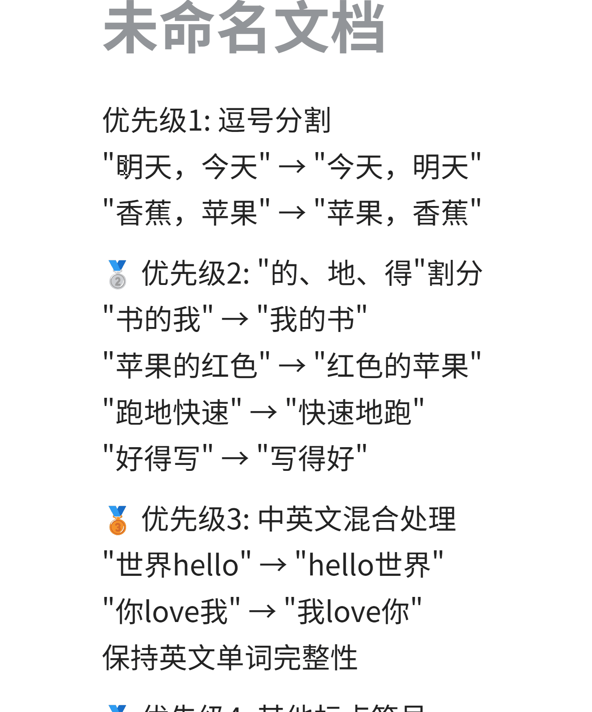

# FlugiClipboard 剪贴板工具 #
[](https://github.com/Idun/FlugiClipboard/stargazers)
[](https://github.com/Idun/FlugiClipboard/network/members)
---
出于个人日常需求而开发，一款功能较强的 Windows 剪贴板管理工具，提供智能拆分选词、文字交换、AI翻译、二维码生成、随手记事、"的地得"智能纠错等多项高级功能。

## 更新日志

### 2025.6.20
- **自定义标题栏设计**: 所有窗口采用统一的现代化自定义标题栏，提供一致的用户体验
- **高性能滚轮优化**: 实现智能滚动加速、防抖动机制，大幅提升滚轮操作的流畅度和响应性
- **窗口大小记忆**: 自动记忆并恢复各窗口的尺寸位置，提供个性化的界面体验
- **系统托盘完整集成**: 支持右键菜单、气泡通知、双击显示等完整托盘功能
- **二维码实时生成**: 文本输入时实时生成二维码，支持防抖动机制和高质量输出
- **二维码图片操作**: 支持高质量图片保存和一键复制到剪贴板功能
- **记事功能完善**: 实时字符计数、自动保存状态提示、置顶切换、快捷键支持
- **"的地得"智能算法**: 基于词性分析和上下文语义的智能纠错，支持常见搭配模式识别
- **分标签页设置界面**: 设置窗口采用现代化分标签设计，功能分类清晰
- **开机启动管理**: 完整的开机启动设置和管理功能
- **历史记录路径自定义**: 支持自定义剪贴板历史保存路径和文件管理
- **多种鼠标操作模式**: 支持单击粘贴、双击粘贴等多种操作方式配置
- **内存智能管理**: 集成 MemoryOptimizer 进行智能内存清理和垃圾回收
- **异步处理优化**: 分词、AI调用等耗时操作采用异步处理，保证界面响应性
- **滚轮性能算法**: 实现连续滚动加速、速度衰减、快速滚动检测等高级滚轮算法

## 🚀 主要功能
### 📋 剪贴板管理
- **卡片式历史记录**: 模仿 Windows 10 剪贴板样式，卡片形式展示内容
- **智能折叠**: 过长内容自动折叠，支持展开/收起
- **历史持久化**: 可配置保存剪贴板历史到本地文件
- **固定功能**: 支持固定重要的剪贴板项目
- **批量清理**: 一键清空所有非固定项目

---



---

### 🎨 界面特性
- **现代化设计**: 采用 Windows 10/11 设计风格
- **响应式布局**: 支持窗口大小调整和记忆
- **系统托盘**: 最小化到系统托盘，支持托盘菜单操作
- **置顶功能**: 可切换窗口置顶状态

---



---

### 🤖 AI翻译功能
- **多平台支持**: 支持 Ollama、DeepSeek、自定义 OpenAI 兼容接口
- **智能翻译**: 自动识别中英文并进行互译
- **结果编辑**: 翻译结果支持编辑和复制
- **快捷操作**: 选中文本后按快捷键即可翻译

### 📱 二维码生成
- **快速生成**: 一键将剪贴板文本转换为二维码
- **高清输出**: 支持高质量二维码图片生成
- **便捷操作**: 支持保存图片和复制到剪贴板
- **独立窗口**: 专用二维码窗口，界面简洁美观

### 📝 随手记事
- **独立面板**: 专用记事窗口，支持多行文本编辑
- **自动保存**: 内容变化时自动标记，支持快捷键保存
- **持久化存储**: 记事内容自动保存到本地文件
- **智能置顶**: 默认置顶显示，便于随时记录
- **状态显示**: 实时显示字符计数和最后保存时间

### ✏️ "的地得"智能纠错
- **智能分析**: 根据语法规则自动识别"的地得"用法错误
- **批量纠正**: 一次性纠正文本中所有"的地得"错误用法
- **上下文理解**: 基于词性分析和常见搭配进行智能判断
- **快捷操作**: 选中文本后按快捷键即可智能纠错

## 🛠️ 技术栈
### 核心技术
- **框架**: .NET 6.0 + WPF
- **UI**: Windows Presentation Foundation (WPF)
- **分词**: JiebaNet 中文分词库
- **二维码**: QRCoder 二维码生成库
- **系统集成**: Win32 API (剪贴板监控、全局热键、窗口操作)
- **网络**: HttpClient (AI API调用)
- **数据**: INI 配置文件存储 + 本地文件持久化

### 编程语言
- **C#**: 主要开发语言
- **XAML**: 用户界面标记语言

### 性能优化
- **异步处理**: 分词和AI调用在后台线程执行
- **内存管理**: 智能内存清理和垃圾回收
- **资源优化**: 限制历史记录数量，自动清理过期文件

## 📖 使用方法
### 基本操作
1. **启动程序**: 双击运行，程序会显示在屏幕上并可选择开机启动
2. **复制监控**: 复制任何文本内容，会自动添加到剪贴板历史
3. **快速呼出**: 按 `Ctrl+Alt+C` 在屏幕中心显示剪贴板窗口
4. **选择粘贴**: 默认双击卡片内容即可粘贴到当前活动文本框光标处


---


### 高级功能
1. **拆分选词**: 右键卡片选择"拆分选词"或点击卡片上的 ✂️ 按钮
2. **文字交换**: 选中文本后按 `Ctrl+Q` 进行中英文、标点等交换彼此位置
3. **AI翻译**: 选中文本后按 `Ctrl+T` 进行智能翻译
4. **二维码生成**: 点击主界面 📱 按钮生成剪贴板文本的二维码
5. **随手记事**: 点击主界面 📝 按钮打开独立记事面板
6. **"的地得"纠错**: 选中文本后使用快捷键智能纠正语法错误
7. **固定项目**: 点击卡片上的 📌 按钮固定重要内容

---


---


---

### 设置配置
- **快捷键**: 可自定义所有功能的快捷键组合
- **AI设置**: 配置AI服务提供商、API地址、模型等
- **历史保存**: 设置历史文件保存路径和限制保存数量
- **启动选项**: 配置开机启动和窗口行为

## ⌨️ 快捷键列表
| 快捷键 | 功能 | 说明 |
|--------|------|------|
| `Ctrl+Alt+C` | 呼出剪贴板 | 在屏幕中心显示剪贴板窗口 |
| `Ctrl+Q` | 智能文字交换位置 | 对中英文混合、带标点符号混合的文字选中，进行互相交换位置 |
| `Ctrl+T` | AI翻译 | 翻译选中的文本内容 |
| `Ctrl+G` | "的地得"智能纠错 | 智能纠正选中文本中的"的地得"用法错误 |

### 记事面板快捷键
| 快捷键 | 功能 | 说明 |
|--------|------|------|
| `Ctrl+S` | 保存记事 | 保存当前记事内容到本地文件 |
| `Esc` | 关闭面板 | 关闭记事面板 |

*所有快捷键均可在设置中自定义*

## 🔧 系统要求
- **操作系统**: Windows 10/11
- **运行时**: .NET 6.0 Desktop Runtime
- **内存**: 建议 4GB 以上
- **存储**: 约 50MB 可用空间

## 📦 安装使用
### 直接运行
1. 下载最新版本的可执行文件
2. 双击 `SimpleTest.exe` 启动程序
3. 首次运行会自动创建配置文件

### 源码运行
```bash
# git clone https://github.com/Idun/FlugiClipboard.git
# ./dotnet run --project FlugiClipboard
```

### 开发环境
1. 克隆项目到本地
2. 使用 Visual Studio 2022 或 VS Code 打开
3. 确保安装了 .NET 6.0 SDK
4. 按 F5 运行调试

## 🏗️ 项目结构
```
FlugiClipboard/
├── MainWindow.xaml(.cs)      # 主窗口 - 剪贴板管理界面
├── SettingsWindow.xaml(.cs)  # 设置窗口 - 配置管理
├── SplitWordsWindow.xaml(.cs)# 分词窗口 - 智能分词功能
├── QRCodeWindow.xaml(.cs)    # 二维码窗口 - 二维码生成功能
├── NoteWindow.xaml(.cs)      # 记事窗口 - 随手记事功能
├── MemoryOptimizer.cs        # 内存优化器 - 性能管理
├── App.xaml(.cs)            # 应用程序入口
├── FlugiClipboard.csproj    # 项目配置文件
└── ico/ilo.ico             # 应用程序图标
```

### ❗ 注意事项
- ❎ 此项目为非专业编程者个人需求所开发，所以会存在自身能力无法解决的Bug
- ❎ 已知 `Ctrl+Q` 的文字交换以及 `Ctrl+T` 的AI翻译，用户无法自定义为三键启动，如 `Ctrl+Shift+Q`，单独的 `Alt+` 其他快捷
- ❎ 运行内存已经优化，但可能仍会占据100m左右
- ❎ AI翻译功能虽然已极力修改并测试，但仍然会出现选中内容被复制到剪切板中
- ❎ 剪切板呼出位置在屏幕中心，测试过以光标位置为出现点，但都不理想
- ❎ 打包版本“设置”相关的会被保存于根目录下的 `settings.ini` 文档中，所以如果有填写API，切记要删除配置文档 `settings.ini` 再分享
- ✅ 新增功能：二维码生成、随手记事、"的地得"智能纠错等功能已经过充分测试
- ✅ 界面优化：所有窗口采用统一的自定义标题栏设计，提供更好的用户体验
- ❎ 感谢 Cursor 以及其他大力支持与协助
- ❎ 其他……

## 🤝 贡献指南
欢迎提交 Issue 和 Pull Request 来改进项目！

### 开发规范
- 遵循 C# 编码规范
- 提交前请运行代码格式化
- 添加适当的注释和文档
- 确保新功能有对应的测试

## 📄 许可证
本项目采用 MIT 许可证，详见 LICENSE 文件。

---

如有问题或建议，请通过以下方式联系：
- 提交 GitHub Issue

**享受高效的剪贴板管理体验！** 🎉
